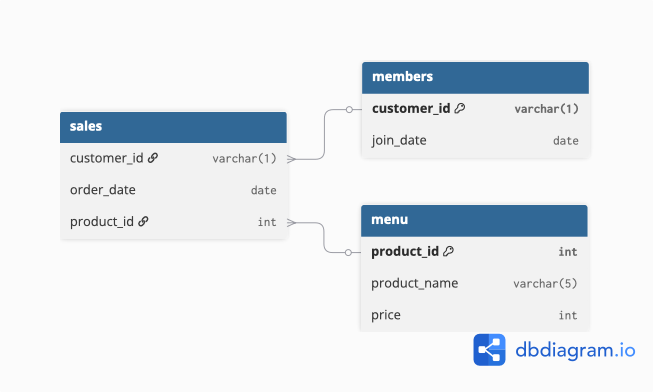

# Case 1 - Danny's Diner

## Table: dannys_diner

## sales table

| customer_id | order_date  | product_id |
|-------------|------------|------------|
| A           | 2021-01-01 | 1          |
| A           | 2021-01-01 | 2          |
| A           | 2021-01-07 | 2          |
| A           | 2021-01-10 | 3          |
| A           | 2021-01-11 | 3          |
| A           | 2021-01-11 | 3          |
| B           | 2021-01-01 | 2          |
| B           | 2021-01-02 | 2          |
| B           | 2021-01-04 | 1          |
| B           | 2021-01-11 | 1          |
| B           | 2021-01-16 | 3          |
| B           | 2021-02-01 | 3          |
| C           | 2021-01-01 | 3          |
| C           | 2021-01-01 | 3          |
| C           | 2021-01-07 | 3          |

## menu table

| product_id | product_name | price |
|------------|-------------|-------|
| 1          | sushi       | 10    |
| 2          | curry       | 15    |
| 3          | ramen       | 12    |

## members table

| customer_id | join_date  |
|-------------|------------|
| A           | 2021-01-07 |
| B           | 2021-01-09 |

 
 

## Queries

1. What is the total amount each customer spent at the restaurant?

| customer_id | total_spent |
|-------------|------------|
| A           | 76         |
| B           | 74         |
| C           | 36         |

 
 

2. How many days has each customer visited the restaurant?

| customer_id | visit_days |
|-------------|-----------|
| A           | 4         |
| B           | 6         |
| C           | 2         |

 
 

3. What was the first item from the menu purchased by each customer?

| customer_id | product_name |
|-------------|-------------|
| A           | sushi       |
| A           | curry       |
| B           | curry       |
| C           | ramen       |
| C           | ramen       |

 
 

4. What is the most purchased item on the menu and how many times was it purchased by all customers?

| product_id | product_name | total_qty |
|------------|-------------|-----------|
| 3          | ramen       | 8         |
| 2          | curry       | 4         |
| 1          | sushi       | 3         |

 
 

5. Which item was the most popular for each customer?

| customer_id | product_name | total_orders |
|-------------|--------------|--------------|
| A           | ramen        | 3            |
| B           | ramen        | 2            |
| B           | curry        | 2            |
| B           | sushi        | 2            |
| C           | ramen        | 3            |

 
 

6. Which item was purchased first by the customer after they became a member?

| customer_id | product_name | order_date  |
|-------------|-------------|-------------|
| A           | ramen       | 2021-01-10  |
| B           | sushi       | 2021-01-11  |

 
 

8. What is the total items and amount spent for each member before they became a member?

| customer_id | total_items | total_amount |
|-------------|-------------|--------------|
| B           | 3           | 40           |
| A           | 2           | 25           |

 
 

9. If each $1 spent equates to 10 points and sushi has a 2x points multiplier - how many points would each customer have?

| customer_id | total_points |
|-------------|--------------|
| A           | 860          |
| B           | 940          |
| C           | 360          |

 
 

10. In the first week after a customer joins the program (including their join date) they earn 2x points on all items, not just sushi - how many points do customer A and B have at the end of January?

| customer_id | total_points |
|-------------|--------------|
| A           | 1370         |
| B           | 820          |

 
 